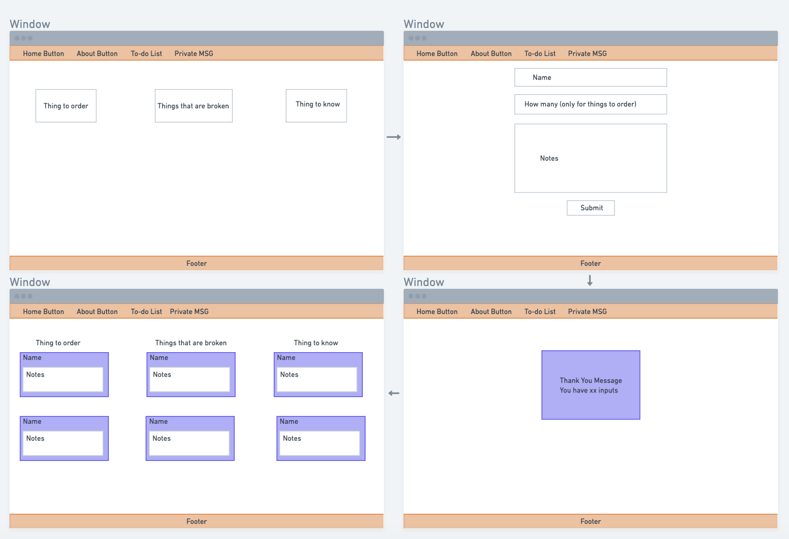
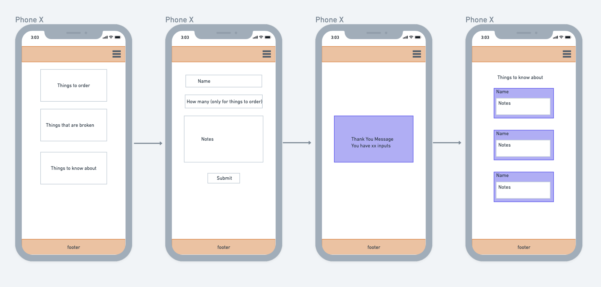
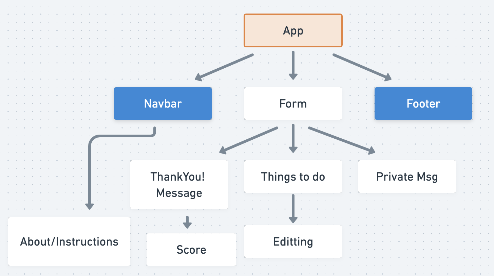

# Project Overview

## Project Name

Things we should know about... Store Edition

## Project Description

At my ice cream store there always seems to be either thing that breakdown or things that are missing and we need to buy more. There are also generally things that my staff should let me know, but never do. The project will basically catalogue inputs of these bits of information in a gamified way.

## Wireframes


<br><br>


<br><br>

## Component Hierarchy


<br><br>

## API and Data Sample

<!-- Show us a snippet of JSON returned by your Airtable (you can find it under the API documentation) so we know you can access it and get the info you need. This __must__ be properly formatted. An example is below:

```json
{
    "records": [
        {
            "id": "recONRzIUTuZ5lXaF",
            "fields": {
                "author": "Liz Yrineo",
                "setup": "Why did the tomato turn red?",
                "punchline": "Because it saw the salad dressing!"
            },
            "createdTime": "2020-11-30T16:03:09.000Z"
        },
        {
            "id": "rec3oYZ5Tp0AIDsKe",
            "fields": {
                "author": "Rachel Moskowitz",
                "setup": "What did the green grape say to the red grape?",
                "punchline": "Breathe, idiot, breathe!"
            },
            "createdTime": "2020-11-30T16:03:09.000Z"
        },
        {
            "id": "recA34tOaoE1IVeC1",
            "fields": {
                "author": "Gary Grant",
                "setup": "How do you make holy water?",
                "punchline": "You boil the hell out of it!"
            },
            "createdTime": "2020-11-30T16:03:09.000Z"
        }
    ],
    "offset": "recA34tOaoE1IVeC1"
}
``` -->

### MVP/PostMVP


#### MVP 

- Find and use airtable api
- Render current entries on page 
- Take user input
- Give user a message 

#### PostMVP  

- Point system based on entires using specific name
- Edit previous inputs
- High score component
- Private msg component

## Project Schedule

This schedule will be used to keep track of your progress throughout the week and align with our expectations. Here's an example.

|  Day | Deliverable | Status
|---|---| ---|
|DEC 1| Prompt / Wireframes / Priority Matrix / Timeframes | Incomplete
|DEC 2| Project Approval | Incomplete
|DEC 3| Core Application Structure (React) & API | Incomplete
|DEC 4 - 6| Pseudocode / actual code | Incomplete
|DEC 7-8| Styling  | Incomplete
|DEC 9| Presentations | Incomplete

## Timeframes

| Component | Priority | Estimated Time | Time Invested | Actual Time |
| --- | :---: |  :---: | :---: | :---: |
| Connecting API | H | 3hrs| 3.5hrs | 3.5hrs |
| Adding sample user inputs | H | 3hrs| 2.5hrs | 2.5hrs |
| Render data to screen| H | 3hrs| 3.5hrs | 3.5hrs |
| Adding form for user | H | 3hrs| 2.5hrs | 2.5hrs |
| Styling with CSS | H | 3hrs| 3.5hrs | 3.5hrs |
| Creating Navbar| H | 3hrs| 2.5hrs | 2.5hrs |
| Creating Footer | H | 3hrs| 3.5hrs | 3.5hrs |
| Adding Media Query| H | 3hrs| 2.5hrs | 2.5hrs |
| Editting Feature| L | 3hrs| 3.5hrs | 3.5hrs |
| Point System Feature L | 3hrs| 2.5hrs | 2.5hrs |
| Total | H | 30hrs| 31hrs | 31hrs |

## SWOT Analysis

### Strengths:

### Weaknesses:

### Opportunities:

### Threats: